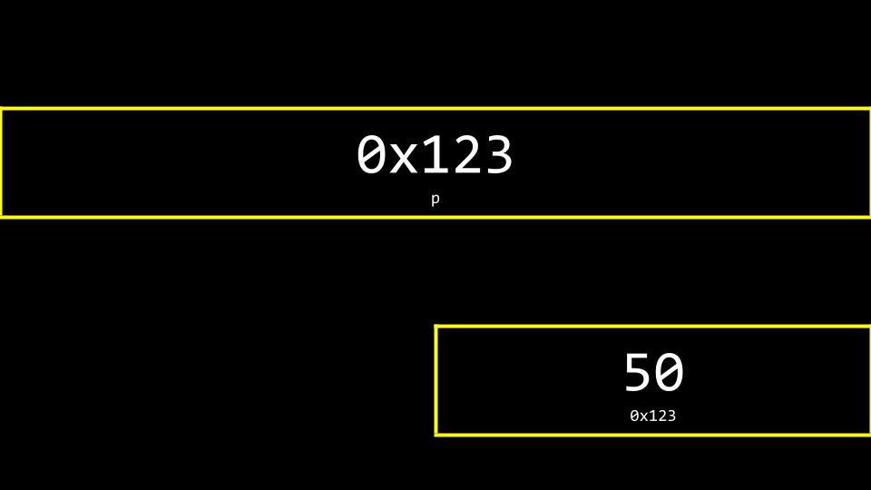
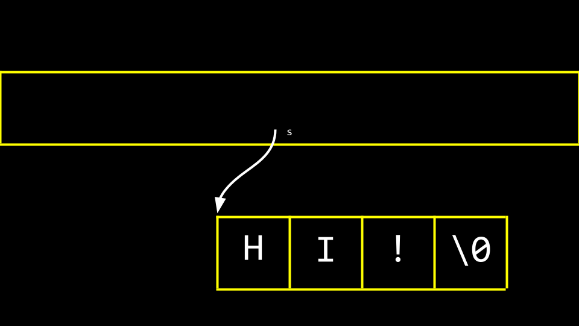

# Week 4 - Memory

## Welcome!
- In previous weeks, we talked about images being made of smaller building blocks called **pixels**. 
- Today, we’ll dive deeper into how these **pixels** are represented in **computer memory** and how we can access the underlying data.

## Pixel Art
Pixels are small squares of color arranged in a grid. You can imagine an image as a map of bits, where:
- `0` represents black
- `1` represents white

RGB (Red, Green, Blue) values determine the color of each pixel. Tools like **Adobe Photoshop** allow us to manipulate these colors. 
Each of these RGB values can be represented using **hexadecimal** (base-16) numbers, which are more compact than the typical decimal system.

## Hexadecimal
**Hexadecimal** is a system of counting that has 16 counting values. **Hexadecimal (base-16)** includes the *numbers 0-9* and *letters A-F*, where `F` represents 15. 

When counting in *hexadecimal*, each column is a *power of 16*. Using two hexadecimal digits, we can represent values from 0 to 255.
- 0 in decimal is `00` in hexadecimal.
- 1 in decimal is `01` in hexadecimal.
- 9 in decimal is `09` in hexadecimal.
- 10 in decimal is `0A` in hexadecimal.
- 15 in decimal is `0F` in hexadecimal.
- 16 in decimal is `10` in hexadecimal.
- 255 in decimal is `FF` in hexadecimal.

Because 255 ÷ 16 = 15 (or F). Add 15 (F) more to make 255. This is the highest number you can count using a two-digit hexadecimal system.

## Memory
Data is stored in memory as blocks, and each block has an address. 


These addresses are often represented in hexadecimal, using the prefix `0x`.


```C
#include <stdio.h>

int main(void)
{
    int n = 50;
    printf("%i\n", n);
}
```
Notice how `n` is stored in memory with the value 50.


The C language has *two powerful operators* that relate to memory:

```text
  & Provides the address of something stored in memory.
  * Instructs the compiler to go to a location in memory.
```

We can leverage this knowledge by modifying our code as follows:

```C
#include <stdio.h>

int main(void)
{
    int n = 50;
    printf("%p\n", &n);
}
```
- Notice the `%p`, which allows us to view the address of a location in memory. 
- `&n` can be literally translated as “the address of n.” 
- Executing this code will return an address of memory beginning with `0x`.


## Pointers
- A *pointer* is a variable that contains the address of some value. Most succinctly, a *pointer* is an address in your computer’s memory.

```C
int n = 50;
int *p = &n;
```
Notice that `p` is a pointer that contains the address of an integer n.

```C
#include <stdio.h>

int main(void)
{
    int n = 50;
    int *p = &n;
    printf("%p\n", p);
}
```
- `printf("%p\n", p)`: prints the **memory address** of the variable n, since `p` holds the address of n.
```C
#include <stdio.h>

int main(void)
{
    int n = 50;
    int *p = &n;
    printf("%p\n", *p);
}
```
- `printf("%p\n", *p)`: prints the `*p` dereferences the pointer p, meaning it accesses the **value stored at the address p** points to, which is the value of n.


You can visualize our code as follows:



## Strings
Recall that a string is simply an *array of characters*. For example, `string s = "HI!"` can be represented as follows:


You can visualize the relationship of `s` to the string as follows:


You can modify your code as follows:
```C
#include <stdio.h>

int main(void)
{
    char *s = "HI!";
    printf("%s\n", s);
}
```
You can also print each character’s memory address:
```C
printf("%p\n", &s[0]); // Address of 'H'
printf("%p\n", &s[1]); // Address of 'I'
printf("%p\n", &s[2]); // Address of '!'
```
## Pointer Arithmetic
```C
#include <stdio.h>

int main(void)
{
    char *s = "HI!";
    printf("%c\n", s[0]);
    printf("%c\n", s[1]);
    printf("%c\n", s[2]);
}
```
Notice that we are printing each character at the location of s.

```C
#include <stdio.h>

int main(void)
{
    char *s = "HI!";
    printf("%c\n", *s);
    printf("%c\n", *(s + 1));
    printf("%c\n", *(s + 2));
}
```
Notice that the first character at the location of s is printed. Then, the character at the location `s + 1` is printed, and so on.

## String Comparison
A *string of characters* is simply an *array of characters* identified by its first byte.

In C, you cannot compare strings using `==` because this compares memory addresses, not the actual string values. 
```C
#include <cs50.h>
#include <stdio.h>

int main(void)
{
    // Get two strings
    char *s = get_string("s: ");
    char *t = get_string("t: ");

    // Compare strings' addresses
    if (s == t)
    {
        printf("Same\n");
    }
    else
    {
        printf("Different\n");
    }
}
```
You can use the following to visualize why:


Instead, you should use the `strcmp` function:
```C
#include <cs50.h>
#include <stdio.h>
#include <string.h>

int main(void)
{
    // Get two strings
    char *s = get_string("s: ");
    char *t = get_string("t: ");

    // Compare strings
    if (strcmp(s, t) == 0)
    {
        printf("Same\n");
    }
    else
    {
        printf("Different\n");
    }
}
```
## Copying
- A common need in programming is to copy one string to another.
- In your terminal window, type `code copy.c` and write code as follows:
```C
#include <cs50.h>
#include <ctype.h>
#include <stdio.h>
#include <string.h>

int main(void)
{
    // Get a string
    string s = get_string("s: ");

    // Copy string's address
    string t = s;

    // Capitalize first letter in string
    t[0] = toupper(t[0]);

    // Print string twice
    printf("s: %s\n", s);
    printf("t: %s\n", t);
```
Notice that `string t = s` copies the address of `s` to `t`. This does not accomplish what we are desiring. The string is not copied – only the address is.


To be able to make an authentic copy of the string, we will need to introduce two new building blocks. 
- First, `malloc` allows you, the programmer, to allocate a block of a specific size of memory. 
- Second, `free` allows you to tell the compiler to free up that block of memory you previously allocated.

```C
#include <cs50.h>
#include <ctype.h>
#include <stdio.h>
#include <stdlib.h>
#include <string.h>

int main(void)
{
    // Get a string
    char *s = get_string("s: ");

    // Allocate memory for another string
    char *t = malloc(strlen(s) + 1);

    // Copy string into memory, including '\0'
    for (int i = 0, n = strlen(s); i <= n; i++)
    {
        t[i] = s[i];
    }

    // Capitalize copy
    t[0] = toupper(t[0]);

    // Print strings
    printf("s: %s\n", s);
    printf("t: %s\n", t);
}
```
Both `get_string` and `malloc` return `NULL`, a special value in memory, in the event that something goes wrong. 

You can write code that can check for this `NULL condition` as follows using the `strcpy`:

```C
#include <cs50.h>
#include <ctype.h>
#include <stdio.h>
#include <stdlib.h>
#include <string.h>

int main(void)
{
    // Get a string
    char *s = get_string("s: ");
    if (s == NULL)
    {
        return 1;
    }

    // Allocate memory for another string
    char *t = malloc(strlen(s) + 1);
    if (t == NULL)
    {
        return 1;
    }

    // Copy string into memory
    strcpy(t, s);

    // Capitalize copy
    if (strlen(t) > 0)
    {
        t[0] = toupper(t[0]);
    }

    // Print strings
    printf("s: %s\n", s);
    printf("t: %s\n", t);

    // Free memory
    free(t);
    return 0;
}
```
Notice that `free` lets the computer know you are done with this block of memory you created via `malloc`.

## malloc and Valgrind
*Valgrind* is a tool that can check to see if there are *memory-related issues* with your programs wherein you utilized `malloc`. Specifically, it checks to see if you `free` all the memory you allocated.

```C
#include <stdio.h>
#include <stdlib.h>

int main(void)
{
    int *x = malloc(3 * sizeof(int));
    x[1] = 72;
    x[2] = 73;
    x[3] = 33;
}
```
While `malloc` is used to allocate enough memory for an array, the code fails to `free` that allocated memory.

If you type `valgrind ./memory`, you will get a report from valgrind that will report where memory has been lost as a result of your program. 

One error that valgrind reveals is that we attempted to assign the value of 33 at the 4th position of the array, where we only allocated an array of size 3. Another error is that we never freed x.

You can modify your code as follow:
```C
#include <stdio.h>
#include <stdlib.h>

int main(void)
{
    int *x = malloc(3 * sizeof(int));
    x[0] = 72;
    x[1] = 73;
    x[2] = 33;
    free(x);
}
```
## Garbage Values
- When you ask the compiler for a block of memory, there is no guarantee that this memory will be empty.
- You may see *junk* or *garbage values*. This is a result of you getting a block of memory but not initializing it.
```C
#include <stdio.h>

int main(void)
{
    int scores[1024];
    for (int i = 0; i < 1024; i++)
    {
        printf("%i\n", scores[i]);
    }
}
```
Running this code will allocate `1024` locations in memory for your array, but the for loop will likely show that not all values therein are 0.

It’s always best practice to be aware of the potential for *garbage values* when you do not initialize blocks of memory to some other value like zero or otherwise.

## Swap

In the real world, a common need in programming is to *swap two values*. Naturally, it’s hard to swap two variables without a temporary holding space. 

```C
#include <stdio.h>

void swap(int a, int b);

int main(void)
{
    int x = 1;
    int y = 2;

    printf("x is %i, y is %i\n", x, y);
    swap(x, y);
    printf("x is %i, y is %i\n", x, y);
}

void swap(int a, int b)
{
    int tmp = a;
    a = b;
    b = tmp;
}
```

Notice that while this code runs, it does not work.  The values, even after being sent to the `swap` function, do not swap. Why?


When you pass values to a function, you are only providing copies. In previous weeks, we discussed the concept of `scope`. The values of `x` and `y` created in the curly `{}` braces of the `main` function only have the scope of the `main` function. 


Notice that *global* variables, which we have not used in this course, live in one place in memory. Various functions are stored in the `stack` in another area of memory.


`main` and `swap` have two separate frames or areas of memory. Therefore, we cannot simply pass the values from one function to another to change them.

Modify your code as follow:
```C
#include <stdio.h>

void swap(int *a, int *b);

int main(void)
{
    int x = 1;
    int y = 2;

    printf("x is %i, y is %i\n", x, y);
    swap(&x, &y);
    printf("x is %i, y is %i\n", x, y);
}

void swap(int *a, int *b)
{
    int tmp = *a; // tmp = 1
    *a = *b;      // x now = 2
    *b = tmp;     // y now = 1
}
```
Variables are not passed by value but by *reference*. 

The addresses of `a` and `b` are provided to the function. Therefore, the `swap` function can know where to make changes to the actual `a` and `b` from the main function.


You can visualize this as follows:
- Before Swap

```
    Memory Address   |   Value
    -------------------------------
        0x100        |     1    <- x
        0x104        |     2    <- y
```
- After Swap

```
    Memory Address   |   Value
    -------------------------------
        0x100        |     2    <- x
        0x104        |     1    <- y
```

## Overflow
- A *heap overflow* is when you overflow the heap, touching areas of memory you are not supposed to.
- A *stack overflow* is when too many functions are called, overflowing the amount of memory available.
- Both of these are considered *buffer overflows*.

## scanf
`scanf` is a *built-in function* that can get user input.
```C
#include <stdio.h>

int main(void)
{
    int x;
    printf("x: ");
    scanf("%i", &x);
    printf("x: %i\n", x);
}
```
Notice that the value of `x` is stored at the location of `x` in the line `scanf("%i", &x)`.

However, consider the following:
```C
#include <stdio.h>

int main(void)
{
    char *s;
    printf("s: ");
    scanf("%s", s);
    printf("s: %s\n", s);
}
```
Notice that no `&` is required because strings are special. Still, this program will not function. Nowhere in this program do we allocate the amount of memory required for our string. 

We have to pre-allocate a certain amount of memory for a string:
```C
#include <stdio.h>
#include <stdlib.h>

int main(void)
{
    char *s = malloc(4);
    if (s == NULL)
    {
        return 1;
    }
    printf("s: ");
    scanf("%s", s);
    printf("s: %s\n", s);
    free(s);
    return 0;
}
```
Simplifying our code as follows:
```C
#include <stdio.h>
#include <stdlib.h>

int main(void)
{
#include <stdio.h>

int main(void)
{
    char s[4];
    printf("s: ");
    scanf("%s", s);
    printf("s: %s\n", s);
}
}
```

Notice that if we pre-allocate an *array of size 4*. However, a string larger than this could create an *error*.

Sometimes, the compiler or the system running it may allocate more memory than we indicate. Fundamentally, though, the above code is unsafe. We cannot trust that the user will input a string that fits into our pre-allocated memory.

## File I/O
You can read from and manipulate files. 
```C
#include <cs50.h>
#include <stdio.h>
#include <string.h>

int main(void)
{
    // Open CSV file
    FILE *file = fopen("phonebook.csv", "a");

    // Get name and number
    char *name = get_string("Name: ");
    char *number = get_string("Number: ");

    // Print to file
    fprintf(file, "%s,%s\n", name, number);

    // Close file
    fclose(file);
}
```
You can create a file called `phonebook.csv` in advance of running the above code. After running the above program and inputting a name and phone number, you will notice that this data persists in your CSV file.

If we want to ensure that `phonebook.csv` exists prior to running the program, we can modify our code as follows:
```C
#include <cs50.h>
#include <stdio.h>
#include <string.h>

int main(void)
{
    // Open CSV file
    FILE *file = fopen("phonebook.csv", "a");
    if (!file)
    {
        return 1;
    }

    // Get name and number
    char *name = get_string("Name: ");
    char *number = get_string("Number: ");

    // Print to file
    fprintf(file, "%s,%s\n", name, number);

    // Close file
    fclose(file);
}
```
We can implement our own copy program:
```C
#include <stdio.h>
#include <stdint.h>

typedef uint8_t BYTE;

int main(int argc, char *argv[])
{
    FILE *src = fopen(argv[1], "rb");
    FILE *dst = fopen(argv[2], "wb");

    BYTE b;

    while (fread(&b, sizeof(b), 1, src) !=0)
    {
        fwrite(&b, sizeof(b), 1, dst);
    }

    fclose(dst);
    fclose(src);
}
```
- `stdint.h`: This library is included for fixed-width integer types, such as uint8_t, which is an unsigned 8-bit integer.
- `fopen(argv[1], "rb")`: This opens the source file (specified by the first command-line argument) in binary read mode (`"rb"`).
- `fopen(argv[2], "wb")`: This opens the destination file (specified by the second command-line argument) in binary write mode (`"wb"`).
- `while` loop repeatedly reads one byte from the source file into `b` using `fread`. 
- `fwrite(&b, sizeof(b), 1, dst)` writes the byte stored in `b` to the destination file `dst`.

## Summing Up
In this lesson, you learned how to:
- Pixel art
- Hexadecimal
- Memory
- Pointers
- Strings
- Pointer Arithmetic
- String Comparison
- Copying
- malloc and Valgrind
- Garbage values
- Swapping
- Overflow
- scanf
- File I/O